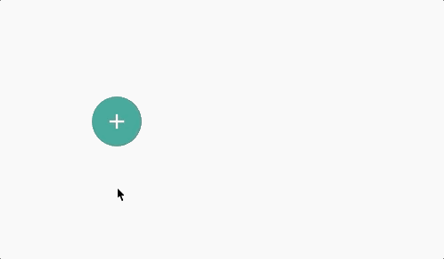

[](https://www.npmjs.com/package/react-laag)
[](http://www.typescriptlang.org/)
[](https://bundlephobia.com/result?p=react-laag)
[](https://badgen.net/npm/dw/react-laag)

Primitives to build things like tooltips, dropdown menu's and pop-overs.

Basically any kind of layer that can be toggled. Focus on **what** your layer should look like, and let react-laag take care of **where** and **when** to show it.




### Documentation

Visit the website for more examples and docs
[here](https://www.react-laag.com).

## Features

- [x] Build your own tooltips / dropdown-menu's / pop-overs / etc...
- [x] Not opinionated regarding styling or animations
- [x] Highly customizable
- [x] Only ~5kb minified and gzipped
- [x] Zero dependencies
- [x] Built with typescript / ships with typescript definitions
- [x] Integrates well with other libraries
- [x] Automatically adjusts your layer's placement to fit the screen
- [x] Works with nested scroll-containers
- [x] Observes and reacts to changes in dimensions

## Getting started

### Installation

```bash
npm install --save react-laag
```

or

```bash
yarn add react-laag
```

### A first component

```jsx
import React from "react";
import { ToggleLayer, anchor } from "react-laag";

function SimplePopover() {
  return (
    <ToggleLayer
      // provide placement config
      placement={{ anchor: anchor.BOTTOM_CENTER }}
      // render-prop to render our layer
      renderLayer={({ layerProps, isOpen }) =>
        // only render on `isOpen`
        isOpen && (
          <div
            // for calculation stuff
            ref={layerProps.ref}
            style={{
              // inject calculated positional styles
              ...layerProps.style

              // add your own styles
            }}
          />
        )
      }
    >
      {({ toggle, triggerRef }) => (
        <div
          // only the `triggerRef` is required...
          ref={triggerRef}
          // ...the rest is up to you
          onClick={toggle}
          style={{}}
        />
      )}
    </ToggleLayer>
  );
}
```

## License

MIT © [everweij](https://github.com/everweij)
