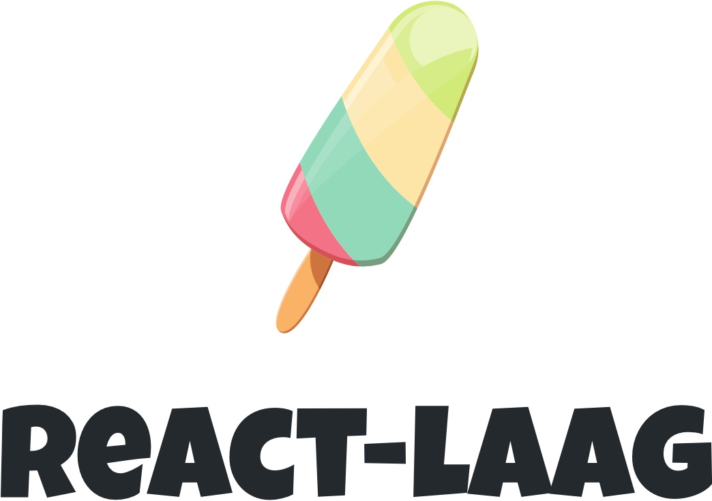

<p align="center">
  
</p>

<h3 align="center" style="margin: 0;">
  Hooks for positioning tooltips & popovers
</h3>

<br>

<p align="center">
  <a href="https://www.npmjs.com/package/react-laag" target="_blank">
    
  </a>
  <a href="http://www.typescriptlang.org/" target="_blank">
    
  </a>
  <a href="https://bundlephobia.com/result?p=react-laag" target="_blank">
    
  </a>
  <a href="https://www.npmjs.com/package/react-laag" target="_blank">
    
  </a>
</p>

<br>

react-laag provides a couple of tools to position UI elements such as tooltips and popovers with ease. It lets you focus on how your UI should look, feel and behave, by taking care of the heavy lifting such as complex calculations you would otherwise have to do yourself.

Try it out for yourself [here](https://www.react-laag.com), or see some examples in our [storybook](https://storybook.react-laag.com).

> Click [here](https://v1.react-laag.com) for the v1 documentation, or read the [release-notes](https://github.com/everweij/react-laag/releases/tag/v2.0.0) for migrating to v2.

### Features

<ul style="list-style: none; padding: 0;">
 <li><span style="margin-right: 16px">📦</span>Only 7kb minified & gzipped / tree-shakable / no dependencies</li>
 <li><span style="margin-right: 16px">🛠</span>We do the positioning, you do the rest. You maintain full control over the look and feel.</li>
 <li><span style="margin-right: 16px">🚀</span>Optimized for performance / no scroll lag whatsoever</li>
 <li><span style="margin-right: 16px">🏗</span>Comes with sensible defaults out of the box, but you can tweak things to your liking</li>
</ul>

### Who is this library for?

If you are working on your own UI library / design-system, or just struggling with some complex auto-complete-select component, react-laag might be a match for you. The flexibility react-laag provides has a small price however: you still have to do some work regarding styling and animations yourself. This pattern is also referred to as _headless UI_.  
So, if you're looking for a full-fledged component out-of-the-box, I recommend to check out the wide range of excellent components already out there.

---

## Table of contents

- [Getting started](#getting-started)
  - [Installation](#installation)
  - [Quick start](#quick-start)
- [API Docs](#api-docs)
  - [useLayer()](<#useLayer()>)
  - [useHover()](<#useHover()>)
  - [\<Arrow />](#arrow)
  - [useMousePositionAsTrigger()](<#useMousePositionAsTrigger()>)
  - [mergeRefs()](<#mergeRefs()>)
- [Concepts](#concepts)
  - [Relative positioning](#relative-positioning)
  - [Nesting](#nesting)
  - [Animations](#animations)
  - [z-index / container](#z-index-/-container)
  - [Resize observer](#resize-observer)
- [FAQ](#faq)
- [Contributing](#contributing)

<br>

## Getting started

### Installation

```bash
# NPM
npm install react-laag

# Yarn
yarn add react-laag
```

This library is build with TypeScript, so type-definitions are shipped out-of-the-box.

### Quick start

We're only scratching the surface here, but here's a quick example to get some sense what this library feels like and how to get going.

```jsx
import * React from "react";
import { useLayer, useHover, Arrow } from "react-laag";

function Tooltip({ children, content }) {
  const [isOver, hoverProps] = useHover();

  const {
    triggerProps,
    layerProps,
    arrowProps,
    renderLayer
  } = useLayer({
    isOpen: isOver
  });

  return (
    <>
      <span {...triggerProps} {...hoverProps}>
        {children}
      </span>
      {isOver &&
        renderLayer(
          <div className="tooltip" {...layerProps}>
            {content}
            <Arrow {...arrowProps} />
          </div>
        )}
    </>
  );
}
```

In order to use this `<Tooltip />` component:

```jsx
const someContent = (
  <div>
    When you hover <Tooltip content="I'm a tooltip!">this</Tooltip> word, you
    should see a tooltip
  </div>
);
```

---

## API docs

### useLayer()

The most important hook for positioning and rendering the layer.

```jsx
import { useLayer } from "react-laag";
```

```tsx
(options: UseLayerOptions): UseLayerProps;
```

#### UseLayerOptions

| name               | type                                                        | required | default        | description                                                                                                                                                                                                                                                                                                                                                                                    |
| ------------------ | ----------------------------------------------------------- | -------- | -------------- | ---------------------------------------------------------------------------------------------------------------------------------------------------------------------------------------------------------------------------------------------------------------------------------------------------------------------------------------------------------------------------------------------- |
| isOpen             | `boolean`                                                   | ✔        |                | signals whether the layer is open or closed                                                                                                                                                                                                                                                                                                                                                    |
| overflowContainer  | `boolean`                                                   |          | `true`         | should the layer be contained within the closest scroll-container (`false`), or is the layer allowed to overflow its closest scroll-container (`true`)?                                                                                                                                                                                                                                        |
| placement          | `string`                                                    |          | `"top-center"` | preferred placement of the layer. One of: `"top-center"` / `"top-start"` / `"top-end"` / `"left-start"` / `"left-center"` / `"left-end"` / `"right-start"` / `"right-center"` / `"right-end"` / `"bottom-start"` / `"bottom-center"` / `"bottom-end"` / `"center"`                                                                                                                             |
| possiblePlacements | `string[]`                                                  |          | all            | in case of `auto: true`, describes which placements are possible. Default are all placements.                                                                                                                                                                                                                                                                                                  |
| preferX            | `"left" \| "right"`                                         |          | `"right"`      | in case of `auto: true`, when both left and right sides are available, which one is preferred?                                                                                                                                                                                                                                                                                                 |
| preferY            | `"top" \| "bottom"`                                         |          | `"bottom"`     | in case of `auto: true`, when both top and bottom sides are available, which one is preferred?                                                                                                                                                                                                                                                                                                 |
| auto               | `boolean`                                                   |          | `false`        | should we switch automatically to a placement that is more visible on the screen?                                                                                                                                                                                                                                                                                                              |
| snap               | `boolean`                                                   |          | `false`        | in case of `auto: true`, should we stick to the possible placements (`true`), or should we gradually move between two placements (`false`)                                                                                                                                                                                                                                                     |
| triggerOffset      | `number`                                                    |          | `0`            | distance in pixels between layer and trigger                                                                                                                                                                                                                                                                                                                                                   |
| containerOffset    | `number`                                                    |          | `10`           | distance in pixels between layer and scroll-containers                                                                                                                                                                                                                                                                                                                                         |
| arrowOffset        | `number`                                                    |          | `0`            | minimal distance between arrow and edges of layer and trigger                                                                                                                                                                                                                                                                                                                                  |
| layerDimensions    | `(layerSide: LayerSide): { width: number, height: number }` |          |                | lets you anticipate on the dimensions of the layer. Usefull when the dimensions of the layer differ per side, preventing an infinite loop of re-positioning                                                                                                                                                                                                                                    |
| onDisappear        | `(type: "partial" \| "full"): void`                         |          |                | gets called when the layer or trigger partially or fully disappears from the screen when the layer is open. If `overflowContainer` is set to true, it looks at the trigger element. If `overflowContainer` is set to false, it looks at the layer element.                                                                                                                                     |
| onOutsideClick     | `(): void`                                                  |          |                | gets called when user clicks somewhere except the trigger or layer when the layer is open                                                                                                                                                                                                                                                                                                      |
| onParentClose      | `(): void`                                                  |          |                | Useful when working with nested layers. It is used by the parent layer to signal child layers that their layers should close also.                                                                                                                                                                                                                                                             |
| container          | `HTMLElement \| (): HTMLElement \| string`                  |          |                | Specify in which container (html-element) the layers should mount into when `overflowContainer` is set to true or when there's no scroll-container found. By default, in such cases the layers are mounted into a generated div#layers which gets attached to the body of the document. This prop accepts various values. When an string is passed, it is interpreted as the id of an element. |
| trigger            | `object`                                                    |          |                | This prop let's you specify information about the trigger you don't know beforehand. This is typically for situations like context-clicks (right-mouse-clicks) and text-selection. By using this prop the returning `triggerProps` of this hook will have no effect.                                                                                                                           |
|                    | `getBounds: () => ClientRect`                               |          |                | A callback function that returns the bounds of the trigger.                                                                                                                                                                                                                                                                                                                                    |
|                    | `getParent?: () => HTMLElement`                             |          |                | A callback function that returns the parent element. This is optional but may be needed in cases where you'll want to prevent overflow of the layer. In other words, if you use the default option `overflowContainer: true`, this callback will have no effect. The returning element is used to position the layer relatively and to register event-listeners.                               |
| environment        | `Window`                                                    | `window` |                | useful when working with iframes for instance, when things like event-listeners should be attached to another context (environment).                                                                                                                                                                                                                                                           |
| ResizeObserver     | `ResizeObserverClass`                                       |          |                | pass a polyfill when the browser does not support ResizeObserver out of the box                                                                                                                                                                                                                                                                                                                |

#### UseLayerProps

| name          | type                                     | required                              | description                                                                                        |
| ------------- | ---------------------------------------- | ------------------------------------- | -------------------------------------------------------------------------------------------------- |
| triggerProps  | `object`                                 | ✔ (unless the trigger-option is used) | Spread these props on the trigger-element                                                          |
|               | `ref: () => void`                        |                                       | Obtains a reference to the trigger-element                                                         |
| layerProps    | `object`                                 | ✔                                     | Spread these props on the layer-element                                                            |
|               | `ref: () => void`                        |                                       | Obtains a reference to the layer-element                                                           |
|               | `style: CSSProperties`                   |                                       | style-object containing positional styles                                                          |
| arrowProps    | `object`                                 |                                       | Spread these props on the arrow-component                                                          |
|               | `ref: () => void`                        |                                       | Obtains a reference to the arrow-element                                                           |
|               | `style: CSSProperties`                   |                                       | style-object containing positional styles                                                          |
|               | `layerSide: LayerSide`                   |                                       | let the arrow-component know in which direction it should point                                    |
| renderLayer   | `(children: ReactNode) => ReactPortal`   |                                       | Render the layer inside this function. Essentially, this is a wrapper arround `createPortal()`     |
| layerSide     | `"top" \| "bottom" \| "right" \| "left"` |                                       | The side the layer is currently on relative to the trigger                                         |
| triggerBounds | `ClientRect \| null`                     |                                       | Bounds of the trigger when `isOpen: true`. Useful when sizing the layer relatively to the trigger. |

### useHover()

Utility hook for managing hover behavior.

```jsx
import { useHover } from "react-laag";
```

```tsx
(options?: UseHoverOptions): [boolean, UseHoverProps, () => void];
```

**Example usage**

```jsx
const [
  isOver, // should we show the layer?
  hoverProps, // spread these props to the trigger-element
  close // optional callback to set `isOver` to `false`
] = useHover({
  delayEnter: 300, // wait 300ms before showing
  delayLeave: 300, // wait 300ms before leaving
  hideOnScroll: true // hide layer immediately when user starts scrolling
});
```

#### UseHoverOptions

| name         | type      | required | default | description                                         |
| ------------ | --------- | -------- | ------- | --------------------------------------------------- |
| delayEnter   | `number`  |          | `0`     | delay in ms                                         |
| delayLeave   | `number`  |          | `0`     | delay in ms                                         |
| hideOnScroll | `boolean` |          | `true`  | sets hovering to `false` when user starts scrolling |

#### UseHoverProps

| name         | type         |
| ------------ | ------------ |
| onMouseEnter | `() => void` |
| onMouseLeave | `() => void` |
| onTouchStart | `() => void` |
| onTouchMove  | `() => void` |
| onTouchEnd   | `() => void` |

### \<Arrow />

```jsx
import { Arrow } from "react-laag";

<Arrow
  angle={45}
  size={8}
  roundness={0}
  borderWidth={0}
  borderColor="#000"
  backgroundColor="#FFF"
  layerSide="top"
/>;
```

`<Arrow />` is basically just an regular svg-element, so it will accept all default svg-props as well

#### ArrowProps

| name            | type     | required | default   | description                                                                    |
| --------------- | -------- | -------- | --------- | ------------------------------------------------------------------------------ |
| angle           | `number` |          | `45`      | Angle of the triangle in degrees. A smaller angle means a more 'pointy' arrow. |
| size            | `number` |          | `8`       | distance in pixels between point of triangle and layer.                        |
| roundness       | `number` |          | `0`       | Roundness of the point of the arrow. Range between `0` and `1`.                |
| borderWidth     | `number` |          | `0`       | Width of the border in pixels                                                  |
| borderColor     | `string` |          | `"black"` | Color of the border                                                            |
| backgroundColor | `string` |          | `"white"` | Color of the arrow                                                             |
| layerSide       | `string` |          | `"top"`   | Determines where to arrow should point to                                      |

### useMousePositionAsTrigger()

Utility hook that lets you use the mouse-position as source of the trigger. This is useful in scenario's like context-menu's.

```jsx
import { useMousePositionAsTrigger } from "react-laag";
```

```tsx
(options?: UseMousePositionAsTriggerOptions): UseMousePositionAsTriggerProps;

type UseMousePositionAsTriggerProps = {
  hasMousePosition: boolean;
  resetMousePosition: () => void;
  handleMouseEvent: (evt: MouseEvent) => void;
  trigger: {
    getBounds: () => ClientRect;
    getParent?: () => HTMLElement;
  };
  parentRef: MutableRefObject;
};
```

**Example usage**

```jsx
function ContextMenu() {
  const {
    hasMousePosition,
    handleMouseEvent,
    resetMousePosition,
    trigger
  } = useMousePositionAsTrigger();

  const { layerProps, renderLayer } = useLayer({
    isOpen: hasMousePosition,
    onOutsideClick: resetMousePosition,
    trigger
  });

  return (
    <>
      <div onContextMenu={handleMouseEvent}>Right-click to show the layer</div>
      {hasMousePosition && renderLayer(<div>Layer</div>)}
    </>
  );
}
```

See the [context-menu example](https://storybook.react-laag.com/?path=/docs/nested-menu-s--page) or [text-selection example](https://storybook.react-laag.com/?path=/docs/text-selection--page) for more info.

#### UseMousePositionAsTriggerOptions

| name           | type      | required | default | description                                              |
| -------------- | --------- | -------- | ------- | -------------------------------------------------------- |
| enabled        | `number`  |          | `true`  | Should the mouse-position currently be actively tracked? |
| preventDefault | `boolean` |          | `true`  | Should `handleMouseEvent` preventDefault()?              |

### mergeRefs()

Utility function that let's you assign multiple references to a 'ref' prop.

```jsx
import * as React from "react";
import { mergeRefs } from "react-laag";

const ref1 = React.useRef();
const ref2 = element => console.log(element);

<div ref={mergeRefs(ref1, ref2)} />;
```

---

## Concepts

### Relative positioning

react-laag allows you to use to methods or modes for positioning with help of the `overflowContainer` option in `useLayer()`. When using `overflowContainer: true`, which is the default behavior, the layer is mounted somewhere high in the document in its own container. In such a case, the positing of the layer will be `fixed`, meaning that it will be positioned relative to the window.  
On the other hand, you can decide you don't want to overflow the container by setting `overflowContainer` to `false`. In this scenario the layer will be mounted right under the scroll-container.  
So, what do we mean by the term 'scroll-container' anyways? react-laag considers a scroll-container an element which has set the `overflow`, `overflow-x` or `overflow-y` style to one of `"auto"` or `"scroll"`. react-laag tries to find these scrollable-containers by traversing up the dom-tree, starting with the trigger-element. This way, the layer will be positioned relatively to the closest scroll-container. There's one catch though: it expect you to set the `position: relative` style on this scroll-container. If you accidentally forgot to set this style, react-laag will output a friendly warning in the console.

### Nesting

Nesting multiple layer often occurs in large menu's where items are grouped. If you're looking for an example of how to accomplish this, be sure to check out the [example](https://storybook.react-laag.com/?path=/docs/nested-menu-s--page) about nesting.

There are however some important things to consider. How do we for instance signal to the rest of the nested layers, that a layer higher up in the hierarchy has just closed? Fortunately, there's a special option for that in the `userLayer()` options: `onParentClose`. react-laag uses context under the hood to monitor which layers are related to each other. This has a couple of implications:

- When a layer closes, it will signal child-layers below to close as well through `onParentClose`.
- `onOutsideClick` only has effect on root-layer. react-laag has a kind of event-bubbling system under the hood to make sure that the root-layer doesn't close when some child-layer down below was clicked. When there was a solid click outside somewhere in the document, the root-layer will signal the rest of the layers to close as well.

### Animations

react-laag doesn't do any animations for you. Why? Because we want to focus this library purely on positioning and there are a lot of libraries out there who do a far better job than react-laag could ever do.  
Since `renderLayer` is just an abstraction over React's `createPortal` you can in theory use any form of animation you'd like.
Personally, I'm a big fan of [framer-motion](https://github.com/framer/motion), so I will show you a quick example to get started:

```jsx
import { useLayer } from "react-laag";
import { motion, AnimatePresence } from "framer-motion";

function AnimationExample() {
  const [isOpen, setOpen] = React.useState(false);

  const { renderLayer, triggerProps, layerProps } = useLayer({ isOpen });

  return (
    <>
      <button {...triggerProps} onClick={() => setOpen(!isOpen)}>
        Click me!
      </button>
      {renderLayer(
        <AnimatePresence>
          {isOpen && (
            <motion.div
              {...layerProps}
              initial={{ opacity: 0 }}
              animate={{ opacity: 1 }}
              exit={{ opacity: 0 }}
            >
              Layer
            </motion.div>
          )}
        </AnimatePresence>
      )}
    </>
  );
}
```

### z-index / container

By design react-laag doesn't handle any z-indexes for you. There are too many different use-cases and scenario's possible for this library to manage. You are free to implement your own z-index strategy. However, there is a cheap fix that will probably fix 95% of your problems.  
By default, react-laag render your layers in a container right under the document's body:

```html
<body>
  <!-- React's entry -->
  <div id="root"></div>

  <!-- By default all layers will we rendered here -->
  <div id="layers"></div>
</body>
```

Now, nothing is stopping you to do this:

```css
#layers {
  z-index: 1000;
}
```

All layers will now automatically inherent the z-index of this container.

If you want react-laag the mount the layers into another element, you have two options:

- use the option in `useLayer()`:

```jsx
const {} = useLayer({
  // pass in an id of the element
  container: "my-own-container-id",

  // pass in a callback returning an html-element
  container: () => myContainer,

  // pass in a html-element directly
  container: myContainer
});
```

- set the container globally:

```jsx
// somewhere in the root of your application
import { setGlobalContainer } from "react-laag";

// works the same as the container-option above
setGlobalContainer("my-own-container-id");
```

### Resize observer

If you want to take full advantage of react-laag positioning change detection, make sure your target browsers support `ResizeObserver`. To get a detailed list which browsers support this feature consult [Can I use](https://caniuse.com/resizeobserver).
As of now, this sort of means all modern browsers except IE 11.
If you need to support IE 11 you can optionally provide your app with a [polyfill](https://github.com/que-etc/resize-observer-polyfill).
If you don't want to pollute the global context you can also pass in the polyfill via the option in `useLayer`:

```jsx
import ResizeObserver from "resize-observer-polyfill";
import { useLayer } from "react-laag";

useLayer({ ResizeObserver });
```

## FAQ

<details>
  <summary>Is there support for accessability?</summary>
  
  No, unfortunately not. There are two primary reasons:
  - This library is primary focussed around positioning
  - Accessability not my area of expertise

I'm open to the idea in the future though. I would be happy to get some help with this!

</details>

<details>
  <summary>Which browsers are supported?</summary>
  
  react-laag works on all modern browsers. Is should also work in >= IE 11, although this may require a polyfill for [stable-features](https://github.com/zloirock/core-js)

</details>

<details>
  <summary>Will this work with server-side-rendering?</summary>
  
  Yes, each build a small tests gets run in other to test compatibility.

</details>

## Contributing

Want to contribute to react-laag? Your help is very much appreciated!
Please consult the [contribution guide](./CONTRIBUTING.MD) how to get started.

## License

MIT © [everweij](https://github.com/everweij)
